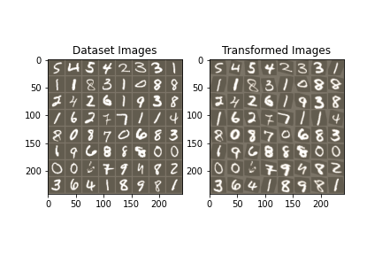

# Spatial Transformer Network

Spatial Transformer Network (STN) that learns and transforms input data to improve geometric invariance.

We build our STN by building a localization net (CNN) which regresses thet transformation parameters, followed by a grid generator which computes the sampling grid (Sequential NN), and finally the sampler which uses the parameters of the transformation and applies it to the image.

As our base model, we implement a 3-layer CNN, and our core model incorporates both the STN and base CNN model. On forward passes, the input is first passed through the STN and the output is then fed into the base CNN.

After training on MNIST, we obtain the example results:

